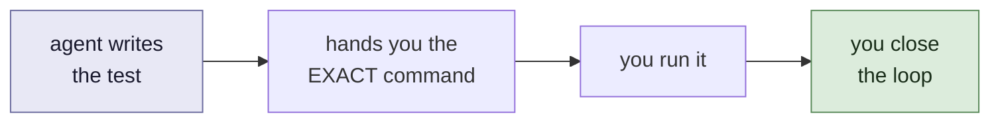
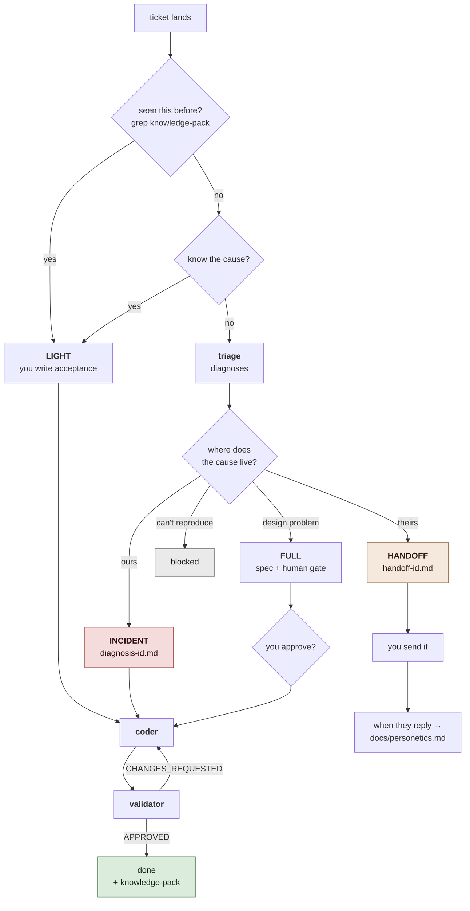
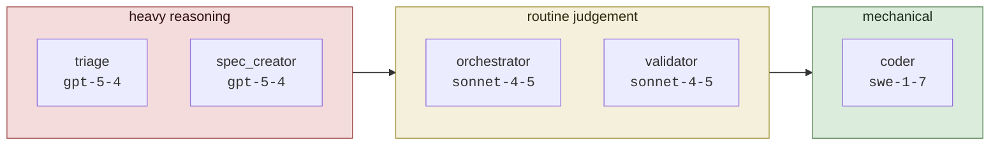
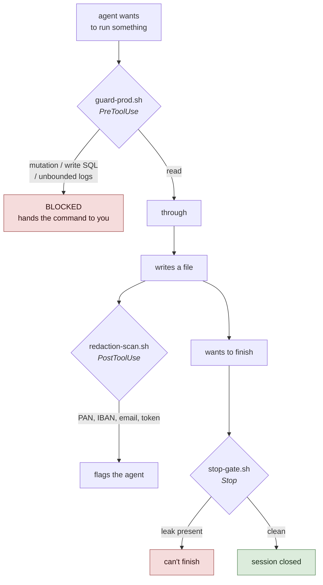

# devin-sdd-harness

<!-- Style: bro (.devin/skills/bro/SKILL.md). Plain language, no ceremony.
     This is the tutorial a human reads on day one. -->

Ok, so this is a harness for working with **Devin CLI / Devin Desktop** on a
middleware team, where 80% of the job is PROD and PRE incidents.

Port of [`claude-sdd-harness`](../claude-sdd-harness) (origin: inspired by /
forked from Bettatech; adapted by Rubén Juárez Pérez).

---

## What this is, in one line

A directory that lives **next to** your repos (never inside them) and gives Devin
three things: fixed roles, a state machine, and guardrails it can't talk its way
past.

```
~/work/
├── devin-harness-port/   ← this
├── service-a/
├── service-b/
└── deploy-manifests/
```

---

## First: what it does NOT do

Worth getting straight before anything else, because it's a deliberate call.

**It does not run your tests, builds, or linters.** Five microservices, suites
run by hand. Automating that is noise for now.

That doesn't mean verification goes away. It means **who executes** changes:



So the agent never tells you "the tests pass". It didn't watch them pass. It says
"written, not run, here's the command: `./mvnw -Dtest=FooTest test`". And the
`validator` rejects a bare "run the tests", because that isn't a command.

What it does still run itself is anything costing one command and no suite:
manifest dry-runs, `helm lint`, parsing a yaml, diffing against the live object.
No point handing you that.

---

## Install (10 min)

```bash
command -v jq            # probably already there — see below
devin auth login
```

**On `jq`:** five scripts here need it, but macOS has shipped it since Sequoia
(macOS 15) at `/usr/bin/jq`, as an Apple binary. If `command -v jq` prints a
path, you're done — no install. Only if it prints nothing do you need
`brew install jq`, and on a managed corporate Mac Homebrew may not be available,
in which case ask IT for `jq` by name. It's a tiny, ubiquitous CLI tool, not a
weird dependency.

Nothing else is required. `yamllint` shows up in a few docs as a way to check
manifests by hand — no script runs it, so skip it unless you want it.

Drop the directory next to your repos and check it's alive:

```bash
cd devin-harness-port
./init.sh
```

Green with WARNs = correct. That's the bootstrap state.

`init.sh` takes about a second and **runs nothing of yours**. It checks
structure, that the state files parse, that subagent frontmatter is valid, the
customer-data scanner, and the guard self-check. Red means an agent broke the
harness or left customer data in the tree. It never means a test failed, because
it never ran one.

### Confirm the models

```bash
devin models list
```

The IDs shipped here are my best guess from the format in Devin's docs
(`swe-1-6-fast` → dashes). If one gets rejected, copy the exact string from there
into `.devin/config.json` and the matching agent's frontmatter.

---

## CLI or Desktop? Both

Devin Desktop is Windsurf rebranded, and the agent inside it (**Devin Local**) is
the same harness as the CLI — Cognition's docs call it "our next-generation agent
harness shared with Devin CLI directly". Same subagent format, same skills
format, same permission model.

So point both at this directory. Nothing to duplicate.

| Piece | CLI | Desktop (Devin Local) |
|---|---|---|
| `AGENTS.md` rules | yes | yes |
| `.devin/agents/*.md` subagents | yes | yes, same format |
| `.devin/skills/*/SKILL.md` | yes | yes, same discovery |
| `.devin/config.json` permissions + deny list | yes | yes |
| `.devin/hooks.v1.json` | yes | **check it — see below** |

### The one thing to verify on Desktop

Hooks are the only piece I could not confirm from the docs. Devin Local supports
hooks, but the docs never name the file it reads, and the older Cascade agent
used a different one (`.windsurf/hooks.json`, with different event names like
`pre_run_command` instead of `PreToolUse`).

Thirty-second check — open a Desktop session in this directory and run:

```
/hooks
```

If it lists SessionStart / PreToolUse / PostToolUse / Stop, you're done, nothing
to do. If it lists nothing, the hooks aren't loading there.

### What you lose if hooks don't load on Desktop

Less than you'd think, because none of the important guards live *only* in a hook:

- **The PROD deny list still holds.** It lives in `.devin/config.json`
  permissions, which Desktop definitely reads. `guard-prod.sh` is the smarter
  second layer (it catches mutations reaching a prod context through a pipe or a
  `--context` flag), but the blunt deny on `kubectl apply|delete|scale|...` is
  what stops the bad stuff, and that's config, not a hook.
- **The redaction scan still runs.** The `validator` runs it as a blocking step
  in its own protocol, and `./init.sh` runs it. The hook is a third net, not the
  only one.
- **`acu.sh` stops auto-logging** — it's driven by SessionStart/SessionEnd. Log a
  session by hand with `./acu.sh` before and after, or just read your usage on
  app.devin.ai. Cosmetic.

If `/hooks` comes back empty and you want the guards back on Desktop, the fix is
to translate `.devin/hooks.v1.json` into `.windsurf/hooks.json` with the Cascade
event names. Don't do it speculatively — check first.

### Which one for what

Nothing stops you switching mid-ticket; the state lives on disk, not in the
session.

- **CLI** for the flow: `/incident`, `/handoff`, the subagent hops. It's what the
  harness was written against.
- **Desktop** when you want eyes on it: reading a long diff, scrolling logs,
  reviewing the diagnosis side by side with the code.

---

## Getting it onto a locked-down machine

No git, no cloud, no USB, no AirDrop? The whole harness is ~50 plain-text files,
so it can travel as a shell script you paste into a terminal.

```bash
./scripts/make-bootstrap.sh              # -> dist/bootstrap.sh   (94 KB, ~1290 lines)
./scripts/make-bootstrap.sh --split 20   # -> dist/part-01.sh ... (5 x ~20 KB)
```

Paste `bootstrap.sh` into a terminal on the target machine and it rebuilds
everything into `./devin-harness-port/`, sets the exec bits, and runs `./init.sh`
to prove it worked. If your terminal chokes on a 1,290-line paste, use the split
parts instead — paste them in order into the same terminal, the last one
extracts.

It only needs `tar`, `base64` and `shasum`, all shipped with macOS.

**It fails loudly rather than half-working.** The payload carries a sha256:

- truncated or mangled paste → checksum mismatch, nothing written to disk
- parts pasted out of order → refuses immediately, tells you to restart at part 1
- target directory already exists → refuses rather than overwriting

**Re-run the generator after any change to the harness and re-paste.** That's the
whole maintenance story. The generator is the artifact; the pasted blob is
disposable, which is why `dist/` is gitignored.

---

## The 4 files you have to fill in

Not optional. Leave them as stubs and every agent re-derives your topology from
scratch on **every** incident, out of your 800 ACUs.

| File | What goes in | Why it pays |
|---|---|---|
| `docs/architecture.md` | services you own, who calls what, where the boundary class is | biggest ACU saver per incident |
| `docs/personetics.md` | their contract, SLAs, known quirks, who to contact | turns "must be them" into a positive finding |
| `docs/environments.md` | clusters, namespaces, where the logs are, what access you have | stops it guessing at `kubectl` contexts |
| `repos.json` | repo paths + the command you run by hand | the agent cites it as the verification path |

And the Confluence exports go in `docs/confluence/`, markdown, one file per page.
There's a README in there on what's worth exporting (spoiler: ten good pages beat
two hundred, because each one costs context).

---

## The full flow

How a ticket moves from landing to closed:



That first diamond saves the most ACUs and it's the one everyone skips. Grepping
the knowledge pack is **free**. A repeat incident with a known cause is a
ten-minute fix, not a two-hour diagnosis.

### The four lanes, short version

**INCIDENT** is the normal one. `triage` writes `specs/<id>/diagnosis-<id>.md`
*before* a line of code exists. That document is the contract, same as a spec is
for a feature. No approval gate — incidents are urgent.

**HANDOFF** is the second most common. When the cause sits inside PERSONETICS
there's nothing to code — `triage` builds an evidence package and you send it.

**LIGHT** when you already know the cause: a typo, a wrong env var, a limit to
bump. Don't pay for a diagnosis to confirm what you already know.

**FULL** is rare here. It exists for real design work and it keeps the human gate.

### The rule that keeps triage honest

> "I can't find it in our code" is **not** evidence the cause is theirs.

To return `handoff` it needs a *positive* finding: a contract violation, an SLA
breach measured at our client, a shape change correlated with a date, or a trace
that dies on their side.

If it has none of those, it has to go back and look at **the boundary** — us
mishandling something they legitimately sent. That's the most common root cause
on a middleware team, and the reflex is always to blame the black box.

---

## Day to day

```bash
./run.sh
```

Then in the session:

```
/incident INC-1234
<paste the ticket>
```

It registers it, greps the knowledge pack, picks the lane, routes it. When the
cause turns out to be theirs:

```
/handoff
```

Builds `specs/<id>/handoff-<id>.md` from what's already on disk. Read it, send it.

And when PERSONETICS answers, **put the answer in `docs/personetics.md`**. That's
the habit that shrinks the black box over time, and it's exactly the one everyone
skips.

### Commands

| Command | What it does |
|---|---|
| `./run.sh` | checks, then starts the session |
| `/incident <id>` | opens an incident from a ticket |
| `/handoff` | builds the PERSONETICS package |
| `/bro` | re-explains the last answer in plain language |
| `/ponytail` | forces the laziest solution that works |
| `./init.sh` | structure + guard check |
| `./acu.sh --budget` | this month's burn + projection |
| `./acu.sh --report` | spend per ticket |
| `./scripts/test-guards.sh` | the 25 guard checks |

---

## The four roles

Each one is a Devin subagent in `.devin/agents/`. The main session is the
**orchestrator**, and that's defined by `AGENTS.md`, not an agent file.

| Role | Model | Does | Never does |
|---|---|---|---|
| **orchestrator** (main session) | `sonnet-4-5` | picks the lane, holds state, delegates | writes code. Closes anything |
| **triage** | `gpt-5-4` | diagnoses one incident → the contract | fixes anything. Touches state |
| **coder** | `swe-1-7` | implements one item + its test | closes it. Touches PRE/PROD |
| **validator** | `sonnet-4-5` | APPROVED / CHANGES_REQUESTED | edits code |
| **spec_creator** | `gpt-5-4` | writes the full-lane spec | writes code |

### Why this split



- **`triage` is where it's won or lost.** A wrong root cause costs way more than
  the model difference. Don't save money here.
- **`coder` is mechanical.** Touch a yml, bump a memory limit, apply a fix that
  already arrives with a `file:line`. `swe-1-7` handles that and it's the
  cheapest thing on your list.
- **`validator` on `sonnet-4-5`** because most of it is walking a checklist and
  reading a diff — but "does this hit the cause or the symptom?" is real
  judgement, which is why it doesn't drop to `swe`.
- **`orchestrator` on `sonnet-4-5`**: routing and holding state needs no more,
  and it's the session that racks up the most turns.

**Sonnet 5 High isn't assigned anywhere.** On purpose: keep it for manually
escalating when a diagnosis or a review comes back weak. Swap the `model:` in the
frontmatter, re-run that agent, swap it back.

**Don't set a global model override.** It flattens the tiering and burns the 800
ACUs doing `swe`-grade work on the expensive model.

---

## The guards

Four things run without being asked. They're why this is safe to point at a
bank's infrastructure.



**1. PROD and PRE are read-only. Blocked, not politely requested.**
`scripts/guard-prod.sh` intercepts every `exec` and cuts mutations, write SQL and
unbounded `kubectl logs`. Plus the deny list in `.devin/config.json` as a second
layer. The agent drafts the command, you run it.

**2. No customer data reaches git.** `scripts/redaction-scan.sh` looks for PANs,
sort codes, IBANs, emails, NI numbers and credential shapes. Runs after every
edit, on every check, and as a `Stop` hook — a session **cannot end** on a leak.
And the `validator` treats a hit as CHANGES_REQUESTED no matter how good the fix.

**3. `./init.sh`** — structure, state, guards. One second.

**Note: the PROD guard fails closed.** If `jq` goes missing, `guard-prod.sh`
can't read the command it's supposed to police, so it blocks *every* `exec` with
a message saying why. Loud and obvious beats a security hook that quietly
switches itself off. If everything suddenly gets blocked, that's your first
thing to check.

**4. The guards have their own tests.**

```bash
./scripts/test-guards.sh
# [OK]   25 checks passed
```

Runs inside `init.sh`. A guard nobody tests is a guard that stopped working and
nobody noticed.

---

## The ACU budget

800 a month. Every spawn costs real money, so `AGENTS.md` makes it a first-class
constraint: read a log, answer a question, check a yaml → the orchestrator does
it itself.

```bash
./acu.sh --budget      # burn rate + end-of-month projection
./acu.sh --report      # spend per ticket
./acu.sh --calibrate 5 # after comparing with real usage on app.devin.ai
```

It's an **estimate** (it measures session time; the CLI exposes no per-session
ACUs). Calibrate it once and forget it.

The three habits that actually control the spend:

1. **Grep the knowledge pack first.** It's free.
2. **Don't spawn `triage` when you already know the cause.**
3. **Keep `docs/` filled in.** Every fact an agent has to rediscover is billed
   again on the next ticket.

---

## Writing style

Not decoration — it decides whether a document gets read or skimmed.

| Document | For whom | Style |
|---|---|---|
| `brief.md` | human, before approving | `no-ai-slop` + Mermaid diagram |
| `walkthrough.md` / `post-mortem-<id>.md` | human, after the review | `bro`, real snippets from the diff |
| `review_<id>.md` | human | `no-ai-slop` |
| `handoff-<id>.md` | human, and it **leaves the bank** | `no-ai-slop` |
| this README | human, day one | `bro` |
| `diagnosis-<id>.md`, specs, `impl_<id>.md` | the AI | no style — it'd be dead weight |

---

## What changed from the Claude version

| Claude harness | Devin port | Why |
|---|---|---|
| `.claude/` | `.devin/` | where Devin looks |
| `CLAUDE.md` + `AGENTS.md` | one lean `AGENTS.md` | Devin injects rules every session; their docs insist on keeping them small |
| `orchestrator.md` subagent | `AGENTS.md` itself | the main session *is* the orchestrator |
| `tutor.md` | dropped | this is work, not a learning portfolio |
| hooks in `settings.json` | `.devin/hooks.v1.json` | same event model, different place |
| `metrics.sh` (tokens) | `acu.sh` (ACUs) | Devin bills ACUs and exposes no token transcript |
| Poetry/pytest gate | structure + guard check | suites run by hand |
| — | **handoff lane** + PERSONETICS package | the team's most-produced artifact |
| — | `docs/redaction.md` + blocking scanner | it's a bank |
| — | `docs/environments.md` + `guard-prod.sh` | PROD read-only, in a hook |
| — | k8s/YAML rules in coder and validator | most diffs here aren't code |

Devin CLI can also read `.claude/` rules directly. This port turns that off on
purpose (`"read_config_from": []`): one harness, one source of context. Two sets
of rules leaking into the same session is a nightmare to debug.

---

## If something breaks

**`./init.sh` dies on `jq not found`** — `brew install jq`.

**Subagents don't spawn** — check `subagents_enabled: true` in
`.devin/config.json`, and that your org policy allows them (org policy wins).

**A model ID gets rejected** — `devin models list`, copy the exact string into
the agent's frontmatter.

**A guard blocks a legitimate read** — run it as an explicit `kubectl
get/describe/logs/top`. If it genuinely has to be something else, run it
yourself; that's the design, not a bug.

**The scanner flags a documented example** — add the path to `SKIP` in
`scripts/redaction-scan.sh`. Don't loosen the regex.

**Hooks don't fire** — `/hooks` in-session shows what's loaded. Paths in
`hooks.v1.json` are relative to the workspace root.
