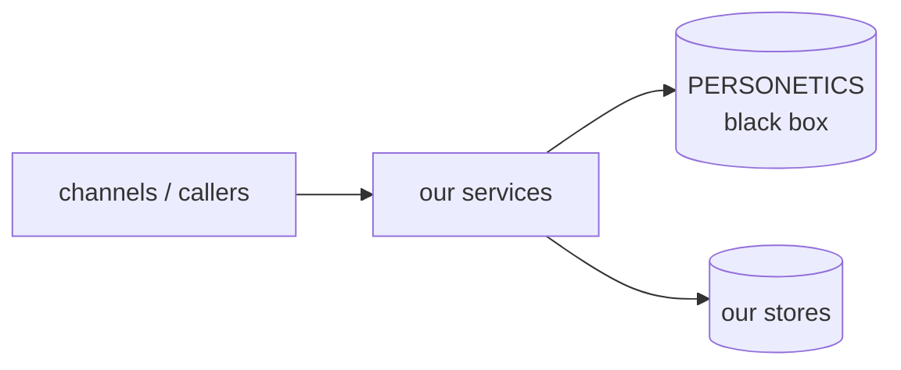

# Architecture — how our slice hangs together

<!-- FILL THIS IN. A stub here means every agent re-derives the topology from
     scratch, which costs ACUs on every single incident. This is the highest
     leverage page in docs/ after personetics.md. -->

## Where we sit

<!-- Replace with the real picture: which services we own, who calls us, what we
     call, what is async vs sync, where the queues are. -->

## Services we own

| Service | Repo | Runtime | Namespace(s) | Calls | Called by |
|---|---|---|---|---|---|

## Layering

<!-- The rule the coder and validator enforce. E.g. controller → service →
     client/repository; errors translated to protocol errors only at the edge;
     no PERSONETICS types leaking past the client layer. -->

## The PERSONETICS boundary

<!-- Which class/module is the ONLY thing that talks to them. Everything the
     validator checks about defensive handling anchors here. -->

## Async, retries and idempotency

<!-- Queues/topics, DLQs, retry policy, what is idempotent and what is not.
     This is where most of the nasty incidents live. -->

## Known fragile spots

<!-- Append as you learn them. One line each, with the ticket that taught it. -->
