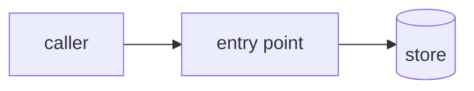

<!-- devin-sdd-harness — port of claude-sdd-harness (origin: inspired by / forked from Bettatech).
     Adapted by Rubén Juárez Pérez. Ported to Devin CLI. -->

<!-- Human-facing summary of the spec, written BEFORE the coder starts.
     Hard cap: ~1 screen. If it doesn't fit, cut prose, never diagrams.
     Style: no-ai-slop (.devin/skills/no-ai-slop/SKILL.md). Short sentences,
     no filler, no "it's worth noting that". -->

# Brief — <feature-id>

**What we're building:** <one or two sentences. Plain language.>

**Why:** <one sentence. The problem it solves.>

## Flow

## What changes

| Where | What | Why |
|---|---|---|
| `path/to/file` | create / modify | <half a line> |

## Decisions that matter

- <decision> — <why, in one line. Only the ones a reviewer would question.>

## Out of scope

- <what we are deliberately NOT doing>

## Open questions

- <blocking question, or `none`>
